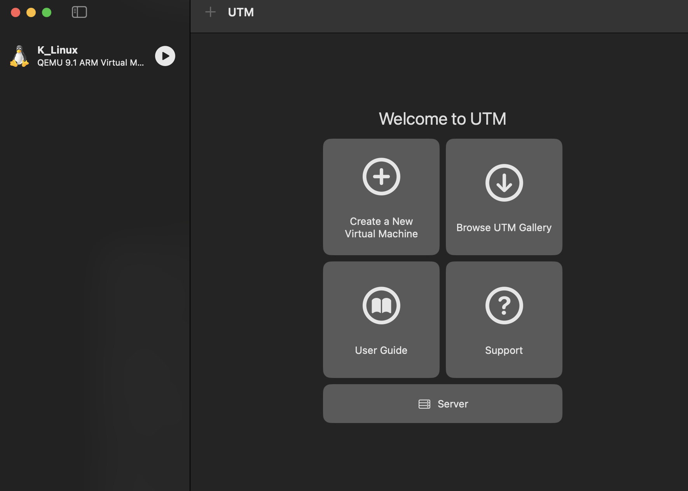

# Virtualization Setup

## Step 1: Installed UTM
- Downloaded from getutm.app.
- Screenshot: 

## Challenges
- Issue: Slow boot on first run.
- Resolution: Enabled hardware acceleration in UTM settings.
